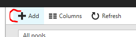
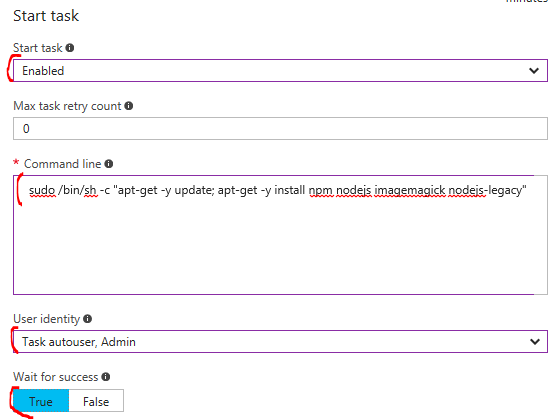

# Azure Batch

In this LAB we will try to set-up Azure Batch environment which allow us to process data in massive parallel way. In our case we will process JPG images - on each image we will run graphic transformation which will put watermark text over image. Transformation itself runs on Ubuntu 16.04 LTS based nodes.
Important is that we can utilize "Low priority nodes" - it means that we can use virtual machines with price reduction up to 80%.

#### How it works?
- Batch service runs pools - pools are group of virtual machines managed by service, machines are automaticaly provisioned/deprovisioned based on setting in Batch Service. During VM provisioning we are able to install necessary software on nodes (Start task)
- Than we have to define job for processing
- And to the job we can push our processing tasks
- Batch service will push tasks to nodes in pool and orchestrate tasks starting/restarting.
- Status of task processing we can observe in Azure portal or via SDK (to build it into our application)

## Azure Batch environment
- Create Azure Batch environment from Azure Portal - by clicking on green button "+" in the left top corner of portal
    - 
    - than enter to search text box "Azure Batch"
    - and select "Batch Service" from list of solutions and resources
    - 
- Follow wizard for Azure Batch creation
    - define Account name
    - define new Resource group for Batch Service
    - 
    -  and create service


## Create pool for running our tasks
- Open already created "Batch Account" in your resource group
- Select option "Pools" in menu
- 
- Click on "+ Add" button in command bar of Pools
- 
- Define pool
    - define Task ID
    - Select Image Type "Marketplace (Linux/Windows)"
    - Publisher "Cannonical"
    - Offer "UbuntuServer"
    - SKU "16.04 LTS"
    - Select Node Size to "A2"
    - Target dedicated nodes - "2", Low priority nodes "2"
    - Enable start task
    - Start task command: 


```
/bin/sh -c "sudo apt-get -y update"
/bin/sh -c "sudo apt-get -y install npm nodejs imagemagick nodejs-legacy"

```

- .
    - User identity: "Task autouser, Admin"
    - And switch "Wait for success" to True
    - 
    - 
    - 
- finally create pool
- you can observe on pool overview pane how nodes are provisioned
- 

## Run our tasks
- Preparation steps
    - we need Blob Storage Account
    - in storage Account please create container (in my case batchtest)
    - and upload plenty of images to some folder (in my case input) - images are processed from input folder and results are uploaded to defined output folder
    - you need node.js for running our app

- download source codes from https://github.com/valda-z/azurebatch-example 
- prepare node js app
    - go to directory AzBatch
    - and run commands: `npm install` and `npm build`
- define environment variables:
    - BLOBKEY=[Your blob storage key]
    - BLOBSTORAGE=[name of blob storage]
    - BLOBCONTAINER=[Blob container]
    - INPUTFOLDER=[Your input folder]
    - OUTPUTFOLDER=[output folder]
    - ACCOUNTNAME=[Your Account name]
    - POOLID=[Your Batch Service Pool ID]
    - ACCOUNTKEY=[Batch Service account key]
    - ACCOUNTURL=[Batch Service account URL]
- and finally run it: `node app.js`
- application will create job and submits tasks for processing, in command line window you can see processing progress
- also you can check status of processing in Azure portal (options "Job" in menu of Batch Service or on overview page of pool)
- There we have commandline output from node.js application and also overview pane for Batch Service Pool with individual state of VM in pool. Also you can play with size of Pool - simply change number of machines by "Scale" option in menu.
- 