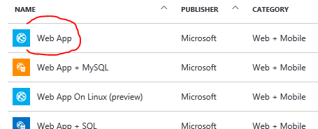

# Java/.NET Web App, Sql(Always Encrypted + TDE)

##### Goal:
Create web app deployed to web app service which uses PaaS Azure SQL database for data storing, SQL database is in TDE mode with enabled Always Encrypted behavior for selected columns in data table.

## Step 1 - create resource group with SQL database:
- Create "SQL Database" (Microsoft/Database)
	- Database name `keyvaulttest`
	- New resource group
	- New database server (select right name there)
- Enable firewall (for demonstration purposes)
	- On created SQL server instance enable firewall "allow" rule for range: `0.0.0.0` - `255.255.255.255`
- Enable TDE on database
	- Select database - Transparent Data Encryption option
	- Swithch encryption "On" and save

## Step 2 - create KeyVault
- In Azure Portal create "Key Vault" in our resource group
- Name: `MyAEKeyVault`
- Extend access policy for key vault also to crypto operations:

## Step 3 - create table with encrypted column:
- Use SSMS to connect to your database
	 	CREATE TABLE [dbo].[ToDo](
	  	[Id] [int] IDENTITY(1,1),
	  	[Note] [varchar](500) NULL,
	  	[MySecretNote] [varchar](500) NULL
	  	PRIMARY KEY CLUSTERED ([Id] ASC) ON [PRIMARY] );
	  	GO
- Encrypt column (on table select "Encrypt column …"

- Define Column Master Key (CMK) and Column Encryption Key (CEK)
- In "Column Selection" select columnt "MySecretColumn" and encryption type "Randomized"

- On "Master Key  Configuration" select "Azure Key Vault", sign into Azure and select our previously created Key Vault

- Finish process - CEK, CMK and encrypted column are provisioned

## Step 4 - generate Active Directory Application credentials:
You must enable your client application to access the SQL Database service by setting up the required authentication and acquiring the ClientId and Secret that you will need to authenticate your application in the following code.
1. Open the **[Azure classic portal](http://manage.windowsazure.com/)**.
2. Select Active Directory and click the Active Directory instance that your application will use.
3. Click Applications, and then click **ADD**.
4. Type a name for your application (for example: myClientApp), select **WEB APPLICATION**, and click the arrow to continue.
5. For the **SIGN-ON URL** and **APP ID URI** you can type a valid URL (for example, http://myClientApp) and continue.
6. Click **CONFIGURE**.
7. Copy your **CLIENT ID**. (You will need this value in your code later.)
8. In the **keys** section, select **1 year** from the **Select duration** drop-down list. (You will copy the key after you save in (12).)
9. Scroll down and click **Add application**.
10. Leave **SHOW** set to **Microsoft Apps** and select **Microsoft Azure Service Management**. Click the checkmark to continue.
11. Select **Access Azure Service Management** from the **Delegated Permissions** drop-down list.
12. Click **SAVE**.
13. After the save finishes, copy the key value in the **keys** section. (You will need this value in your code later.)

## Step 5 - give access to application in Key Vault:
- Select your Key Vault
- In Access Policies create new entry for your application identified by name
	- Select principal
	- Use template SQL Server Connector
	- Select additional Key permissions "Verify", "Sign"
- Save changes

## Step 6 - Prepare web app:
| .NET track | Java track |
|--------|--------|
| Create Web App (Microsoft / Web + Mobile) | Create Web App on Linux
| | - Leve node.js, we will change it later on during configuration |

## Step 7 - Build and deploy:
| .Net track | Java track |
|--|--|
| • Git: https://github.com/valda-z/webapp-keyvault-sqlalwayzencrypted | • Prerequisites: Maven, Docker, Java JDK 8 |
| • .NET project uses these NuGet packages | • Create Azure Container Registry: Enable "Admin user access" and remember user and user key |
| `Install-Package Microsoft.SqlServer.Management.AlwaysEncrypted.AzureKeyVaultProvider` | • Download source codes / Git: https://github.com/valda-z/webapp-keyvault-sqlalwayzencrypted |
| `Install-Package Microsoft.IdentityModel.Clients.ActiveDirectory` | • Build JAR and docker image: `mvn clean package docker:build` |
| • Publish to your web app from Visual Studio | • Publish to private docker registry |
|  | `docker login <YOUR REPO>.azurecr.io -u <YOUR USERNAME> -p "<YOUR KEY>"` |
|  | `docker tag valdazure/sqlkeyvault <YOUR REPO>.azurecr.io/valdazure/sqlkeyvault` |
|  | `docker push <YOUR REPO>.azurecr.io/valdazure/sqlkeyvault` |

## Step 8 - Configure web app and run:
| .Net track | Java track |
|--|--|
| • Select your Web App and change "Application settings" | • Select your Web App and change "Application settings" |
| • • • App setting | • • • App setting |
| • • • • • • applicationADID = "Your CLIENT ID for application in AD" | • • • • • • SQLSERVER_CLIENTID = "Your CLIENT ID for application in AD" |
| • • • • • • applicationADSecret = "KEY value for CLIENT ID from AD" | • • • • • • SQLSERVER_CLIENTKEY = "KEY value for CLIENT ID from AD" |
| • • • Connection strings | • • • • • • SQLSERVER_URL = `jdbc:sqlserver://<YOUR DATABASE SERVER>.database.windows.net;user=<YOUR DB USER>;password=<YOUR DB PASSWORD>;databaseName=keyvaulttest;columnEncryptionSetting=Enabled;` |
| • • • • • • DefaultConnection = `data source=######.database.windows.net;initial catalog=keyvaulttest;persist security info=True;user id=######;password=######;Column Encryption Setting=Enabled;MultipleActiveResultSets=True;App=EntityFramework` | • • • • • • PORT = `8080` |
| • Test your app on **HTTP** and **HTTPS** | • "Docker Container" setting |
|  | • • • Select "Private registry" |
|  | • • • Image and optional tag = `<YOUR REPO>.azurecr.io/valdazure/sqlkeyvault` |
|  | • • • Server URL = `https://<YOUR REPO>.azurecr.io/valdazure/sqlkeyvault` |
|  | • • • Login username = `<YOUR USERNAME>` |
|  | • • • Password = `<YOUR KEY>` |
|  | • • • Startup command = `-e SQLSERVER_CLIENTID -e SQLSERVER_CLIENTKEY -e SQLSERVER_URL` |
|  | Test your app on **HTTP** and **HTTPS** |

