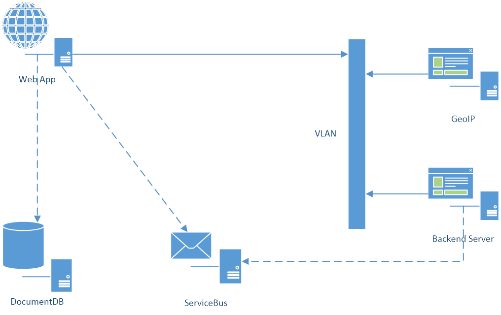

# Java Web App, DocumentDB, VLAN and Service Bus

Simple ToDo application which stores data in DocumentDB and calls backend service "GeoIP" on VLAN (simulating on-prem system). Each request is also serialized to JSON send to Service Bus topic.

Main source code repository: https://github.com/valda-z/documentdb-java-todo-app

## Scenario 1 - Web App Tomcat + DocumentDB
- Create Web App Tomcat
- Create DocumentDB in same resource group
- JAVA IDE
	- .\documentdb-java-todo-app\src\com\microsoft\azure\documentdb\sample\dao\DocumentClientFactory.java
		- Change `HOST` and `MASTERKEY` to corresponding values from DocumentDB instance
	- Compile WAR
- Download war to Web App (ftp) - to `site/webapps` folder (appname.war)
- Start web app - appname

## Scenario 2 (continue from 1) - Web App Tomcat + Client mutual authentication)
- Information there:
	https://azure.microsoft.com/en-gb/documentation/articles/app-service-web-configure-tls-mutual-auth/
	
- Create file enableclientcert.json:
		{ "location": "North Europe",
		"properties": {
		"clientCertEnabled": true } } 
- Run ARMClient (installation procedure for armclient: https://chocolatey.org/packages/ARMClient)
	`ARMClient.exe PUT subscriptions/##############/resourcegroups/WebAppSSL/providers/Microsoft.Web/sites/valdasslwebj?api-version=2015-04-01 @enableclientcert.json -verbose`
	- Alternate process: https://msftplayground.com/2016/06/azure-app-service-and-client-certificate-authentication/
- Start Web App appname - on SSL and provide some certificate to site, certificate is processed and parsed.
- You can change now implementation in ApiServlet.java - put there code which will validate thumbprint against list of valid thumbprints.

## Scenario 3 (continue from 1) - Web App Tomcat + DocumentDB + VLAN private running REST server
- Create VNET for web app
	- Select web app
	- Networking -> create VNET … (setup)
	- Networking -> setup -> add vnet - 40 minutes deployment!!! (Web App has to have Standard or Premium plan - plan can be changed directly by link)
		- after deployment of VLAN once again check Network setting in Web App "Networking" - probably you have to run Setup again and select created VLAN in previous step
- Create GeoIP Service host
	- Create linux VM in VNET
		- Ubuntu 16.04
		- `sudo apt update --yes &sudo apt dist-upgrade --yes`
		- Docker: `wget -qO- https://get.docker.com/ | sh`
		- `mkdir geoip`
		- `cd geoip`
		- Download geoip DB: `wget http://geolite.maxmind.com/download/geoip/database/GeoLite2-City.mmdb.gz`
		- Unzip: `gzip -d GeoLite2-City.mmdb.gz`
		- Pull image: `docker pull klauspost/geoip-service`
		- Run geoip server:  `docker run -d -p 5000:5000 -v /home/valda/geoip/GeoLite2-City.mmdb:/data/geodb.mmdb klauspost/geoip-service`
- Change IP address in `.\documentdb-java-todo-app\src\com\microsoft\azure\documentdb\sample\comm\GeoIPClient.java` to internal IP address of docker VM with GeoIP service

## Scenario 4 (continue from 1) - Web App Tomcat + DocumentDB + ServiceBus
- Resources:
	- https://azure.microsoft.com/en-us/documentation/articles/event-hubs-csharp-ephcs-getstarted/
	- https://azure.microsoft.com/en-us/documentation/articles/service-bus-java-how-to-use-topics-subscriptions/
	- https://azure.microsoft.com/en-us/documentation/articles/service-bus-dotnet-get-started-with-queues/
- Tools: service bus explorer: https://code.msdn.microsoft.com/windowsapps/Service-Bus-Explorer-f2abca5a
- Deploy "Service Bus" to resource group
	- Create Topic (default values) - name "mytopic"
	- Create Subscription for "all" messages
	- Optionally define additional subscription named "category"
		- Define via "Service-Bus-Explorer" app
		- New Subscription with condition: Category = '?????'
- Update connection information to Topic
	- Update connection information in `.\documentdb-java-todo-app\src\com\microsoft\azure\documentdb\sample\esb\TopicHelper.java`
	- Change 1st parameter in connection to valid Service Bus name, than change 3rd parameter for primary key value.
- Compile war and deploy to Azure
	- Compile project: https://github.com/valda-z/documentdb-java-todo-backendrunner
		- Update connection string to DocumentDB
			- Update connection information in `.\documentdb-java-todo-backendrunner\src\com\microsoft\azure\documentdb\sample\dao\DocumentClientFactory.java`
			- Change HOST and MASTERKEY to corresponding values from DocumentDB instance
		- Update connection to Topic
			- Update connection information in `.\documentdb-java-todo-backendrunner\src\com\microsoft\azure\documentdb\sample\esb\TopicHelper.java`
			- Change 1st parameter in connection to valid Service Bus name, than change 3rd parameter for primary key value.
- Run JAVA background process in Linux virtual machine
	- Copy `servicebus-backendrunner-1.0-SNAPSHOT.jar` and `lib/` folder to target machine
	- Run: `java -jar servicebus-backendrunner-1.0-SNAPSHOT.jar`

## Scenario 5 (continue from 4) - nano-service in Function App
- Create Function App in resource group
- Create new Function App from "ServiceBus Topic" example template
	- Define input parameter to our Topic (connection, topic name, subscription name)
	- Define output parameter - connection to DocumentDB, use existing DocumentDB (Database: -  TestDB, ID: TestCollection)

