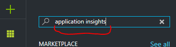

# JAVA Web App, SQL, DocumentDB, ServiceBus, Function Apps, Application Insights

Simple ToDo application which uses spring-boot front end, data are stored in Azure SQL database and each new ToDo item is processed to Service Bus. From Service bus are messages processed by Function Apps which are connected to Service Bus events. Function Apps create new entries in DocumentDB which is used like a storage for "comments" record for each ToDo record.  


## Prepare Azure resources

- Create Web App and Resource group which will host our application
    - in Azure portal click on resource group button in tool bar and than on "+ Add" button
    - 
    - Enter Resource group name and select right location for your resources
    - 
    - Create Web App - click on green "+" button in left top corner and enter "web app" to search area and press enter
    - 
    - Azure will show list of resources which can be created, use "Web App On Linux" - Microsoft/Web + Mobile and click "Create Button
    - 
    - Enter valid app name and select your existing Resource group created in previous steps
    - Create new App service pan for your web app.
    - Leave "node" container service, we will configure right docker configuration later on.
    - 
- Create Azure SQL database
    - Again use green "+" for creating new resource, enter "sql" to search area and press Enter
    - 
    - From list of resources select "SQL Database" - Microsoft/Database and than click Create button
    - 
    - Enter following data in creation form:
        - valid "Database name"
        - use existing Resource group created in previous steps
        - Create new "Server"
            - valid "Server name"
            - valid "Server name login"
            - valid "Password"
            - and right Location for your server
            - than click on Select button
        - Select right pricing tier
        - Click on Create button 
    - 
- Create DocumentDB database
    - Use green "+" button and and enter "documentdb" to search area
    - 
    - From list of resources select "NoSQL (DocumentDB)" - Microsoft/Storage and click Create
    - 
    - Enter valid ID for database
    - Use existing Resource group and right location for your resource
    - Click on Create button
    - 
- Wait for deploying all services

## Create private docker registry
- Use green "+" button and enter "azure container service" in search box
- 
- Select Azure Container Registry (preview)
- 
- Click on Create button
- Enter valid registry name
- Select your resource group
- Enable Admin user
- 
- Click on Create button
- Collect security information (LOGIN SERVER, USERNAME, PASSWORD)
- 


## Build and deploy Web App

#### Prepare build environment and build

- Prerequisites
    - installed JAVA 8, maven, docker, git
- Clone sources from github: `git clone https://github.com/valda-z/java-webapp-sql-servicebus-insights.git`
- Update pom.xml file 
    - Open pom.xml file and change `docker.image.url` in `properties` section to `LOGIN SERVER` value from your Azure Container Registry
- Locate your maven setting.xml file
    - You can use `mvn -X` to show location of your setting.xml (line starting with `[DEBUG] Reading user settings from`
    - Edit or create this file and update content of `server` section in settings file.

```xml
<settings xmlns="http://maven.apache.org/SETTINGS/1.0.0"
  xmlns:xsi="http://www.w3.org/2001/XMLSchema-instance"
    xsi:schemaLocation="http://maven.apache.org/SETTINGS/1.0.0
                          https://maven.apache.org/xsd/settings-1.0.0.xsd">
  <servers>
    <server>
       <id>docker-hub</id>
       <username>[USERNAME]</username>
       <password>[PASSWORD]</password>
       <configuration>
          <email>foo@foo.bar</email>
       </configuration>
    </server>
  </servers>
</settings>
```

- Build docker image
    - `mvn clean package docker:build` 

#### Publish docker image to private registry

- Push docker image to your private docker repository
    - `mvn clean package docker:build -DpushImage`

#### Configure Web App for docker private registry

- In Azure console open your Web App
- Click on "Docker Container" option
    - Change image source to "Private Registry"
    - Set "Image and optional tag" to  `<YOUR REGISTRY NAME>-microsoft.azurecr.iovaldazure/javawebapp:latest`
    - Set "Server URL", "Login Username" and "Password" to reflect your private registry settings
    - Save settings
- 
- Click on "Application settings" option
- Define these variables in App setting section
    - `SQLSERVER_URL` - set JDBC URL to your SQL database (connection string can be collected from your SQL database setting in Azure console)
    - `DOCDB_HOST` - DocumentDB host name
    - `DOCDB_KEY` - DocumentDB key
    - Save settings
- 
- Test your web app (get URL from web app Overview pane

## Create Service Bus and test messaging
- Use green "+" button and enter "service bus" in search box
- 
- From resources list select Service Bus - Microsoft / Internet of Things and click Create button
- 
- Enter valid name for your Service Bus, select your existing resource group and right location for deployment
- 
- Click Ok button
- Configure Service Bus
    - Collect necessary information for connecting
        - Select in resource group your Service Bus
        - In Overview pane click on link "Connection Strings"
        -    
        - In the list of Shared access policies select "RootManageSharedAccessKey"
        - On detail pane select "primary key" and copy primary key value
        - Next copy the name of service bus (for example from "connection string"
        - 
    - Create Topic "todotopic
        - Select option "Topics" in section Entities on your Service Bus
        - Click on button "+ Topic"
        - 
        - In the pane for New Topic define name "todotopic" for topic
        - 
        - And click on Create button
        - Go back to list of Topics (you have to click on Queues and than back to Topics to refresh list)
        - In the list of Topics select our "todotopic"
        - In Topic detail view select option "Subscriptions"
        - And create new Subscription by clicking on button "+ Subscription"
        - 
        - Define name "all" for default subscription
        - 
        - And click on button Create

- Configure Web App
    - Select Web App (App service) in your resource group
    - In App Service pane select option "Application settings"
    - In App settings section define variables 
        - `SBUS_NAME` and for value use service bus name for your Service Bus
        - `SBUS_KEY` and for value use service bus primary key for your Service Bus
    - 
    - Save changes in Application settings
    - Test your Web App in browser
        - Now application hast to create service bus messages in topic "todotopic"
        - Use application Service Bus Explorer if messagess are really created in your topic (download from: https://code.msdn.microsoft.com/windowsapps/Service-Bus-Explorer-f2abca5a) 
            - Messages are created only for new ToDoes    

## Create Func App for messages processing

- Prepare additional subscription with condition routing for demonstration
    - Use Service Bus Explorer, connect to your Service Bus (use URI connection string)
    - Open "todotopic" and click by right mouse button on Subscriptions
    - Select from menu "Create Subscription"
        - Subscription name "critical"
        - To "Filter" field insert this condition: `Category = 'CRITICAL'`
        - Click on button "Create"

- Use green "+" button and enter "function app" to search box
- 
- From list of resources select "Function App"
- 
- Press Create button
- Enter valid name for Function App - field "App name"
- Select your existing resource group
- 
- Click on Create button

#### Function app for processing "critical" subscription
- Select your Function App in resource group 
- In left pane of Function App workplace select "+ New Function"
- 
- From list of available templates select "ServiceBusTopisTrigger - JavaScript"
- 
- Enter valid name for your function, name of Topic in your service bus (in our case todotopic) and name of Subscription (in our case critical)
- Define connection to Service Bus by clicking on link "New" near by Service Bus connection
- 
- Define new connection to service bus
    - Click on Add a connection string
    - Define connection name
    - Insert Connection string to your service bus
    - 
- Click on Create button
- In your new Function click on option "Integrate"
- 
- An there in detail view select "New Output"
- 
- In the list of possible output resources select "Azure DocumentDB Document)
- 
- In documentdb form define
    - Database name to `ToDoDB`
    - Collection Name to `ToDoComments`
- 
- Click on link "new" near by DocumentDN account connection and select your existing DocumentDB
- 
- Click on Save button
- Go back to your function and select option "Develop"
- 
- Update JavaScript code in following way:

```javascript
module.exports = function(context, mySbMsg) {
    context.log('JavaScript ServiceBus topic trigger function processed message: ', mySbMsg);
        context.bindings.outputDocument = {
            Id : 'xxxxxxxx-xxxx-4xxx-yxxx-xxxxxxxxxxxx'.replace(/[xy]/g, function(c) {var r = Math.random()*16|0,v=c=='x'?r:r&0x3|0x8;return v.toString(16);}),
            todoGid : mySbMsg.gid,
            created : new Date(),
            comment : "Your ToDo item has CRITICAL category, this message is from Azure Function App.."
        } 
        context.log('JavaScript ServiceBus topic trigger function inserting document: ', context.bindings.outputDocument);
    context.done();
};
```

- Save changes

#### Function app for processing "all" subscription

- Create new Function in same way like in the previous example (from template ServiceBusTopisTrigger - JavaScript)
- define connection to existing Service Bus
- use Topic name `todotopic`
- and Subscription name `all`
- define output to your DocumentDB 
- use this JavaScript code for Function:

```javascript
module.exports = function(context, mySbMsg) {
    context.log('JavaScript ServiceBus topic trigger function processed message: ', mySbMsg);
    if(mySbMsg.note.search(/azure/i) > 0){
        context.bindings.outputDocument = {
            id : 'xxxxxxxx-xxxx-4xxx-yxxx-xxxxxxxxxxxx'.replace(/[xy]/g, function(c) {var r = Math.random()*16|0,v=c=='x'?r:r&0x3|0x8;return v.toString(16);}),
            todoGid : mySbMsg.gid,
            created : new Date(),
            comment : "Your ToDo item contains important word AZURE, this message is from Azure Function App.."
        } 
        context.log('JavaScript ServiceBus topic trigger function inserting document: ', context.bindings.outputDocument);
    }
    context.done();
};
```


## Profile Web App with Application Insights

Information source: https://docs.microsoft.com/en-us/azure/application-insights/app-insights-overview

#### Create Application Insights

- Use green "+" button and enter "application insights" in search box
- 
- From resources list select Application Insights and click Create button
- 
- Than enter valid name for Application Insights
- Select Application Type to "Java web application"
- Use existing resource group for your lab 
- 
- Click on Create button

#### Enable detail analyses on project

Information source: https://docs.microsoft.com/en-us/azure/application-insights/app-insights-java-get-started

- Find the instrumentation key for Application Insigths
    - Click on your Application Insights in your resource group
    - Go to pane Overview, click on label "Essential" and copy "Instrumentation Key"
    -  
- Merge the following code to your pom.xml file

```xml
    <dependency>
        <groupId>com.microsoft.azure</groupId>
        <artifactId>applicationinsights-web</artifactId>
        <!-- or applicationinsights-core for bare API -->
        <version>[1.0,)</version>
    </dependency>
```

- Create file `ApplicationInsights.xml` in ./src/main/resources folder with this content  

```xml
<?xml version="1.0" encoding="utf-8"?>
<ApplicationInsights xmlns="http://schemas.microsoft.com/ApplicationInsights/2013/Settings" schemaVersion="2014-05-30">


  <!-- The key from the portal: -->

  <InstrumentationKey>** Your instrumentation key **</InstrumentationKey>


  <!-- HTTP request component (not required for bare API) -->

  <TelemetryModules>
    <Add type="com.microsoft.applicationinsights.web.extensibility.modules.WebRequestTrackingTelemetryModule"/>
    <Add type="com.microsoft.applicationinsights.web.extensibility.modules.WebSessionTrackingTelemetryModule"/>
    <Add type="com.microsoft.applicationinsights.web.extensibility.modules.WebUserTrackingTelemetryModule"/>
  </TelemetryModules>

  <!-- Events correlation (not required for bare API) -->
  <!-- These initializers add context data to each event -->

  <TelemetryInitializers>
    <Add   type="com.microsoft.applicationinsights.web.extensibility.initializers.WebOperationIdTelemetryInitializer"/>
    <Add type="com.microsoft.applicationinsights.web.extensibility.initializers.WebOperationNameTelemetryInitializer"/>
    <Add type="com.microsoft.applicationinsights.web.extensibility.initializers.WebSessionTelemetryInitializer"/>
    <Add type="com.microsoft.applicationinsights.web.extensibility.initializers.WebUserTelemetryInitializer"/>
    <Add type="com.microsoft.applicationinsights.web.extensibility.initializers.WebUserAgentTelemetryInitializer"/>

  </TelemetryInitializers>
</ApplicationInsights>
```

- Replace file `JavWebApp.java` in ./src/com/microsoft/azuresample/javawebapp with this content:

```java
package com.microsoft.azuresample.javawebapp;

import com.microsoft.applicationinsights.web.internal.WebRequestTrackingFilter;
import org.springframework.boot.SpringApplication;
import org.springframework.boot.autoconfigure.EnableAutoConfiguration;
import org.springframework.boot.autoconfigure.SpringBootApplication;
import org.springframework.boot.builder.SpringApplicationBuilder;
import org.springframework.boot.web.servlet.FilterRegistrationBean;
import org.springframework.boot.web.support.SpringBootServletInitializer;
import org.springframework.context.ApplicationContext;
import org.springframework.context.annotation.Bean;
import org.springframework.context.annotation.ComponentScan;
import org.springframework.context.annotation.Configuration;

@Configuration
@ComponentScan
@EnableAutoConfiguration
public class JavaWebApp  extends SpringBootServletInitializer {

    public static void main(String[] args) {
        ApplicationContext ctx = SpringApplication.run(JavaWebApp.class, args);
        System.out.println("My Spring Boot app started ...");
    }

    @Override
    protected SpringApplicationBuilder configure(SpringApplicationBuilder application) {
        return application.sources(applicationClass);
    }

    private static Class<JavaWebApp> applicationClass = JavaWebApp.class;

    @Bean
    public FilterRegistrationBean filterRegistrationBean() {
        final FilterRegistrationBean filterRegistrationBean = new FilterRegistrationBean();
        final WebRequestTrackingFilter webRequestTrackingFilter = new WebRequestTrackingFilter();
        filterRegistrationBean.setFilter(webRequestTrackingFilter);
        return filterRegistrationBean;
    }
}

```

- Build and deploy app: `mvn clean package docker:build -DpushImage`
- restart Web App
- update App setting and define variable `APPLICATION_INSIGHTS_IKEY` which will contain Application Insights Key (Instrumentation Key).

#### Enable collection of Browser page data
- In Azure portal select your Application insight resource in your resource group
- In Overview page click on "Learn how to collect browser page load data." (Or you can use "Getting started" option from Application Insight pane in section "Configure"
- 
- In Client side telemtry page copy to clipboard prepared JavaScript fragment
- 
- In your index.html page paste JavaScript code to the section of javascripts.
- Save page
- Build and deploy app: `mvn clean package docker:build -DpushImage`
- restart Web App
- See new statistics for browser page data in Application Insights

## Performance testing

Information source: https://docs.microsoft.com/en-us/azure/app-service-web/app-service-web-app-performance-test 

- Select your Web App in resource group and click on option "Performance test"
- In detail page click on link "Set Account"
- 
- If you have no Team Service Account than create new one by clicking on link "Or Create New"
- 
- Enter valid account name, select subscription for account and Location for account
- 
- By clicking on button Ok account will be created or selected
- Than click on button "+ Add" in Performance test detail
- 
- Define Test details in Performance test pane
- 
- Than click on button Run test
- After test execution see test results

