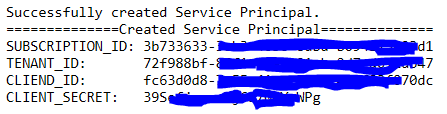
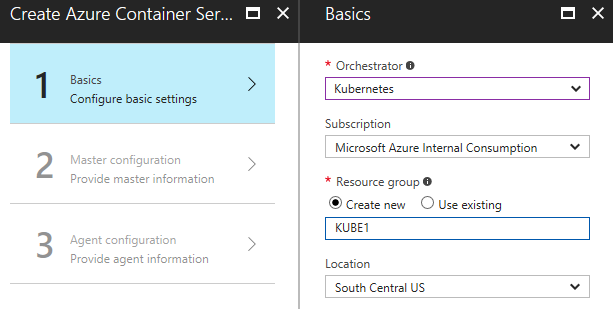
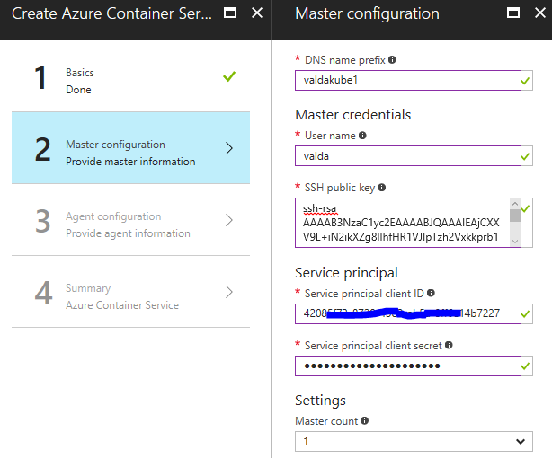
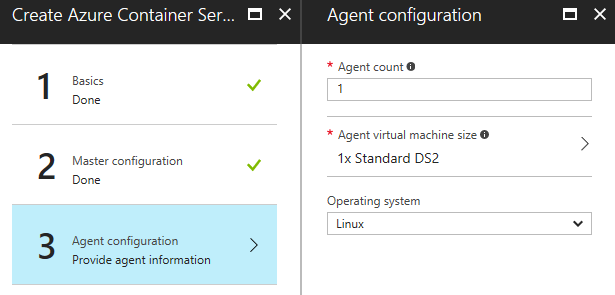
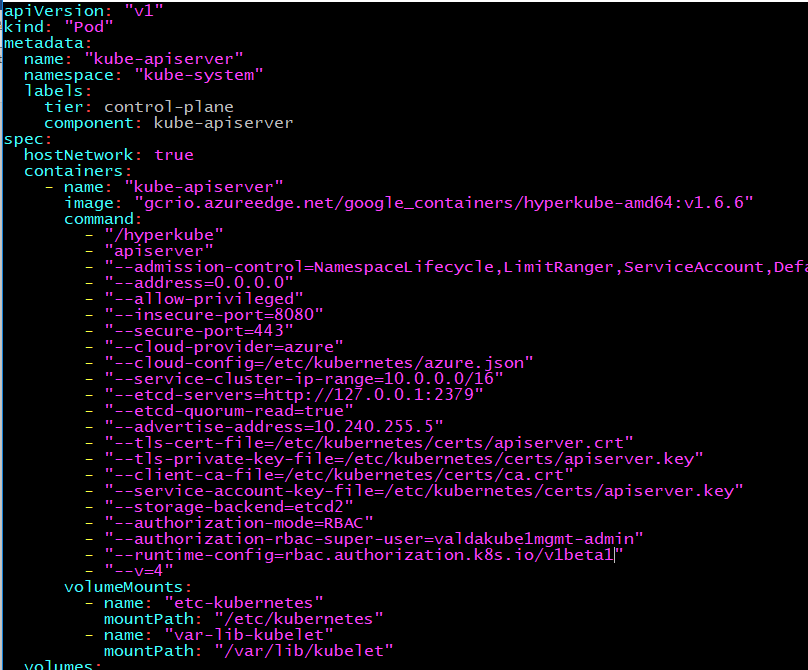
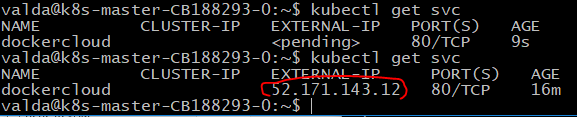
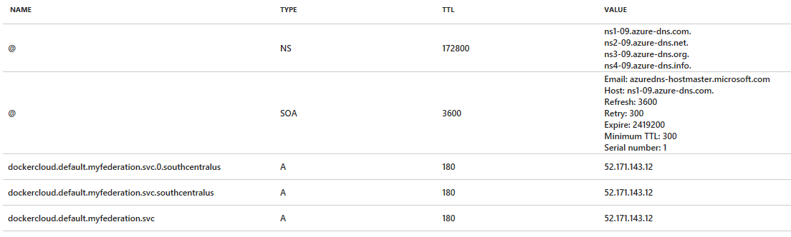
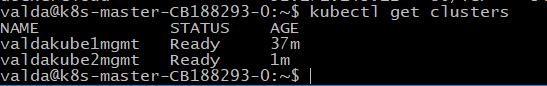
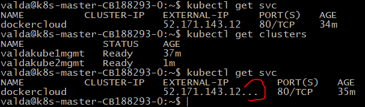
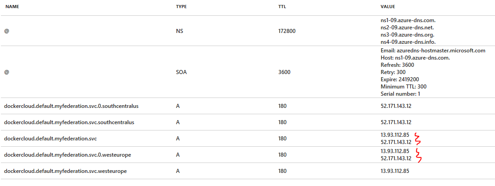

# Orchestrate orchestrators – Kubernetes federation cluster

Experimental installation of Kubernetes cluster in Azure based on description published by Christoph Schittko ( [https://github.com/xtophs](https://github.com/xtophs)). Original post: [https://github.com/xtophs/k8s-setup-federation-cluster](https://github.com/xtophs/k8s-setup-federation-cluster)

This LAB material requires installation of Azure DNS zone and two Azure Container Service clusters orchestrated by Kubernetes. Tested on Kubernetes version 1.6.6.

## Prerequisites:

- Azure subscription
- Created service principal with full privileges – for Kubernetes cluster and for Kubernetes Federation DNS agent – in my case I used Cloud Foundry script for Azure (principal has to be created with full access): [https://github.com/cloudfoundry-incubator/bosh-azure-cpi-release/blob/master/docs/get-started/create-service-principal.md](https://github.com/cloudfoundry-incubator/bosh-azure-cpi-release/blob/master/docs/get-started/create-service-principal.md)
  - Service principal is created in this form (we will need these credentials later)
  - 


## Installation steps

### Create Azure DNS Zone

- Create new DNS Zone in Azure
  - In my case I used DNS zone **kube.valda.cloud**
  - Resource group: KUBEDNS

### Install first Kubernetes cluster

- Create new Azure Container Service cluster with Kubernetes orchestrator
  - Use SSH key for authentication (same key we have to use for second cluster)
  - Use 1 master, 1 node (default machine size is OK for cluster)
  - Create separate resource group for cluster
    - Cluster name: valdakube1
    - Resource group: KUBE1
    - Region South Central US

  - 
  - 
  - 


### Configure federation

- Connect to valdakube1 cluster via ssh (ssh valda@valdakube1mgmt.southcentralus.cloudapp.azure.com) – you can collect DNS name from public IP address configuration…
- Create a Permissive Cluster Role binding
- `kubectl create clusterrolebinding permissive-binding   --clusterrole=cluster-admin   --user=client --user=kubeconfig   --group=system:serviceaccounts`
- update configuration for RBAC in file /etc/kubernetes/manifests/kube-apiserver.yaml

```
[...]
spec:
  hostNetwork: true
  containers:
    - name: "kube-apiserver"
      image: "gcrio.azureedge.net/google_containers/hyperkube-amd64:v1.6.2"
      command:
        - "/hyperkube"
        - "apiserver"
[...]
        - "--authorization-mode=RBAC"
        - "--authorization-rbac-super-user=valdakube1mgmt-admin"
        - "--runtime-config=rbac.authorization.k8s.io/v1beta1"
[...]


```




- Reboot master node to apply new configuration
- Install new version of kubernetes tools (again on master in first cluster):
- `curl -LO https://dl.k8s.io/v1.7.0-alpha.4/kubernetes-client-linux-amd64.tar.gz`
- `tar xzf kubernetes-client-linux-amd64.tar.gz`
- `sudo cp kubernetes/client/bin/kubefed /usr/local/bin`
- `sudo chmod +x /usr/local/bin/kubefed`
- `sudo cp kubernetes/client/bin/kubectl /usr/local/bin`
- `sudo chmod +x /usr/local/bin/kubectl`
- Create DNS configuration file dns.conf (and replace information about your subscription and service principal)

```
[Global]
subscription-id = **xxxxxxxxxxxxxxxx**
tenant-id = **xxxxxxxxxxxxxxxx**
client-id = **xxxxxxxxxxxxxxxx**
secret = **xxxxxxxxxxxxxxxx**
resourceGroup = KUBEDNS
```

- Create federation
- `kubefed init myfederation --host-cluster-context=valdakube1mgmt  --dns-provider=&quot;azure-azuredns&quot; --dns-zone-name=&quot;kube.valda.cloud&quot; --dns-provider-config=/home/valda/dns.conf --image=xtoph/hyperkube-amd64:azuredns.20`
- create DEFAULT namespace in federation
- `kubectl create namespace default --context=myfederation`
- switch to cluster federation
- `kubectl config use-context myfederation`
- join first cluster
- `kubefed join valdakube1mgmt --host-cluster-context=valdakube1mgmt --cluster-context=valdakube1mgmt`
- create dockercloud replicaset and service (we must prepare yaml files)
- create file: dp-rs.yaml

```
apiVersion: extensions/v1beta1
kind: ReplicaSet
metadata:
  name: dockercloud
spec:
  replicas: 4
  template:
    metadata:
      labels:
        app: dockercloud
    spec:
      containers:
        - name: hostname
          image: dockercloud/hello-world
          resources:
            requests:
              cpu: 100m
              memory: 100Mi

```

- Create file: dp-svc.yaml

```
apiVersion: v1
kind: Service
metadata:
  labels:
    app: dockercloud
  name: dockercloud
spec:
  ports:
  - port: 80
    protocol: TCP
    targetPort: 80
    name: http
  selector:
    app: dockercloud
  type: LoadBalancer
  
```

- Let&#39;s provision application to cluster
- `kubectl create -f dp-rs.yaml`
- `kubectl create -f dp-svc.yaml`
- wait for provisioning … - we have to wait to provision public IP address
- `kubectl get svc`
- 
- And then we can see also new records in our DNS zone
- 
- And finally you can access sample we app on exposed endpoint (in my case http://52.171.143.12)

### Install second cluster

- Install second cluster in different datacenter
  - In my case
    - Resource group: KUBE2
    - Cluster name: valdakube2

### Second cluster will join federation

- From second cluster (ssh valda@valdakube2mgmt.westeurope.cloudapp.azure.com) download file .kube/config to first cluster (home directory) but with name .kube/config.2
- On original cluster (first one) define new env variable for kubectl
- `export KUBECONFIG="/home/valda/.kube/config:/home/valda/.kube/config.2"`
- join second cluster to federation (again on first one – be carefull – you must use context myfederstion)
- kubefed join valdakube2mgmt --host-cluster-context=valdakube1mgmt --cluster-context=valdakube2mgmt
- 
- update dp-rs.yaml file (to use resources on both clusters)

```
apiVersion: extensions/v1beta1
kind: ReplicaSet
metadata:
  name: dockercloud
  annotations:
    federation.kubernetes.io/replica-set-preferences: |
        {
            "rebalance": true,
            "clusters": {
                "valdakube1mgmt": {
                    "minReplicas": 2,
                    "maxReplicas": 4,
                    "weight": 1
                },
                "valdakube2mgmt": {
                    "minReplicas": 2,
                    "maxReplicas": 4,
                    "weight": 1
                }
            }
        }
spec:
  replicas: 4
  template:
    metadata:
      labels:
        app: dockercloud
    spec:
      containers:
        - name: hostname
          image: dockercloud/hello-world
          resources:
            requests:
              cpu: 100m
              memory: 100Mi

```

- redeploy our container app
- `kubectl replace -f dp-rs.yaml`
- check status with kubectl get svc (if it shows three dots in IP then second cluster finished deployment)
- 
- and after while see changes in DNS Zone
- 

Now you can test http web server on both IP addresses (both clusters)