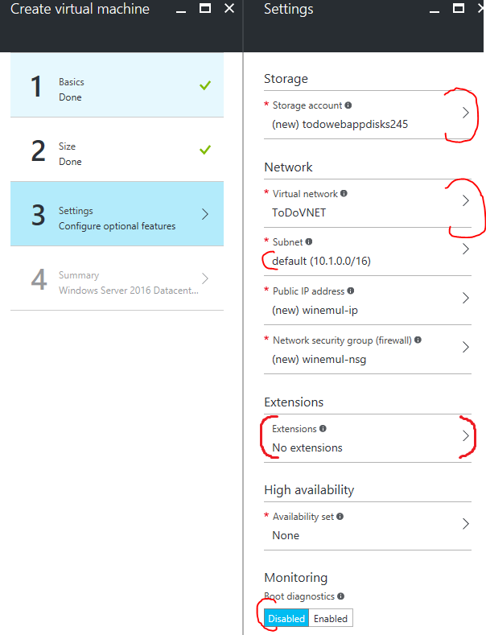
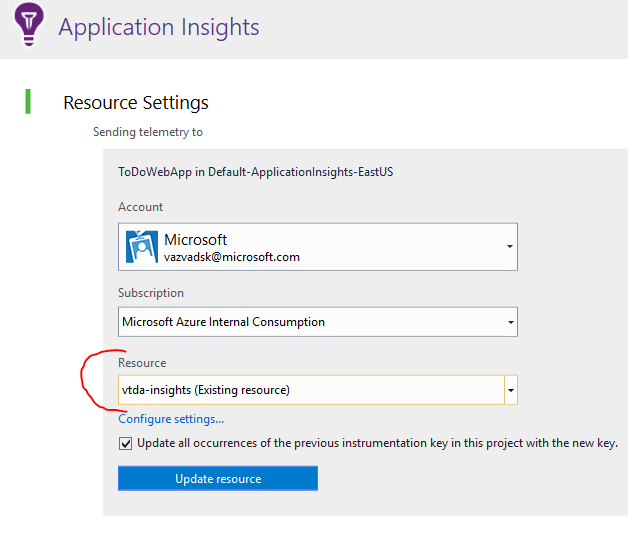

# .NET Web App, SQL, DocumentDB, ServiceBus, Function Apps, Application Insights

Simple ToDo application which uses ASP NET MVC front end, data are stored in Azure SQL database and each new ToDo item is processed to Service Bus. From Service bus are messages processed by Function Apps which are connected to Service Bus events. Function Apps create new entries in DocumentDB which is used like a storage for "comments" record for each ToDo record.  

## Prepare Azure resources

- Create Web App and Resource group which will host our application
    - in Azure portal click on resource group button in tool bar and than on "+ Add" button
    - 
    - Enter Resource group name and select right location for your resources
    - 
    - Create Web App - click on green "+" button in left top corner and enter "web app" to search area and press enter
    - 
    - Azure will show list of resources which can be created, use "Web App" - Microsoft/Web + Mobile and click "Create Button
    - 
    - Enter valid app name and select your existing Resource group created in previous steps
    - 
- Create Azure SQL database
    - Again use green "+" for creating new resource, enter "sql" to search area and press Enter
    - 
    - From list of resources select "SQL Database" - Microsoft/Database and than click Create button
    - 
    - Enter following data in creation form:
        - valid "Database name"
        - use existing Resource group created in previous steps
        - Create new "Server"
            - valid "Server name"
            - valid "Server name login"
            - valid "Password"
            - and right Location for your server
            - than click on Select button
        - Select right pricing tier
        - Click on Create button 
    - 
- Create DocumentDB database
    - Use green "+" button and and enter "documentdb" to search area
    - 
    - From list of resources select "NoSQL (DocumentDB)" - Microsoft/Storage and click Create
    - 
    - Enter valid ID for database
    - Use existing Resource group and right location for your resource
    - Click on Create button
    - 
- Wait for deploying all services

## Deploy Web App

- Publish App directly from Visual Studio
    - click right mouse on project ToDoWebApp and select "Publish" menu item
    - In publishing wizard select "Microsoft Azure App Service"
    - 
    - In case that needed re-enter your credential to Azure subscription
    - Select your subscription 
    - Select right Resource group
    - And select right Web App for deployment (created in previous steps)
    - 
    - click "Ok", wizard will load necessary information from your Subscription
    - Continue to next screen with default values (Web Deploy method)
    - On "Setting" screen continue with default (don't enter any information about connection string)
    - Continue with "Next" button and start deployment with "Publish" button

- Configure Web App in Azure portal 
    - Prerequisites - collect connection strings for resources
        - In Azure portal select your resource group and than select instance of DocumentDB
            - In Document DB pane select option "Keys" and collect data from "URI" and "PRIMARY KEY"
            -           
        - Select your "SQL database"
            - In SQL database pane select "Overview" option and than select link "Show database connection string", also you will need database user name and databse password used during database creation.
            - 
    - Select your Web App (App Service) from resource group
        - In App Service pane select option "Application settings"
        - In Application setting change following data
            - Switch application to 64 bit
            - 
            - In App setting section define variables for DOCDB_URL (DocumentDB URI), DOCDB_KEY (PRIMARY KEY)
            - 
            - In Connection strings section define connection with name DefaultConnection (with valid username and password)
            - 
        - Save changes in Application settings
- Now you can test application on URL which is shown in App Service Overview panel on HTTP or HTTPS

## Create VLAN for on-prem emulator

- In Azure portal select your resource group and than your Web App (App Service)
- Select in pane "Networking" option and in VNET Integration section click on link "Setup"
- 
- Than click on "Create New Virtual Network and in definition pane enter name of your Virtual Network,  address definition has to use default values, finally click on "OK"
- 
- Now wait for **aprox 40 minutes** for VLAN deployment
- Again select Web App, "Networking" option
- In Networking options select **again** link "Setup" in VNET Integration section and select your created VLAN in previous steps
- Finally we have to see connected our virtual network
- 

## Create on-prem emulator in VLAN (VM)

Use on of the following emulator version - Linux or Windows system. Emulator itself is dockerized core-net application with RESTFull interface running on port 5000 of VM.
During creation of VMs you will use Custom Extension Scripts, these scripts are run after VM base image is provisioned and it can install or configure host operating system, see code in our scripts for detail.

#### Windows version of emulator
Windows version of emulator running on Windows 2016 server with docker extension, docker image itself is installed by Extension Script (extension script also creates scheduled task which startups docker image after reboot.
- Use green "+" button and enter "windows server 2016 datacenter - containers" in search box
- 
- From list of resources select "Windows Server 2016 Datacenter - with Containers"
- 
- Press Create button.
- Enter server name, username, password and select your Resource group and right location and press Ok button
- 
- Select machine size - D1v2 or D1 is enough
- In Settings pane leave "new" storage account, check that our VLAN for Web App is selected and "default" subnet is selected, switch Monitoring / boot diagnostic to "Disabled" and configure "Extension" - see next image with detailed Extension configuration
- 
- Click "Add extension" link and select "Custom Script Extension" from list of available extension - than click on Create button
- 
- Download extension script: https://raw.githubusercontent.com/valda-z/azure-samples-doc/net-webapp-sql-servicebus-insights/setups.ps1 
- Select setup.ps1 file to the "Script File" field
- Enter to "Arguments" this command: `powershell.exe -ExecutionPolicy Unrestricted -File setup.ps1`
- Click on Ok button and on parent pane also on Ok button
- Finally confirm Setting pane by Ok button
- 
- On last pane "Summary" confirm server creation process by Ok button
- After successful deployment check if server is really running in Azure console and **restart server** again to apply installed changes

#### Linux version of emulator
Linux version of emulator running on Ubuntu Server 16.04 with docker, Ubuntu server is installed and configured by Extension Script.
- Use green "+" button and enter "Ubuntu Server 16.04" to search box
- 
- From list of resources select "Ubuntu Server 16.04 LTS"
- 
- Press Create button
- Enter server name, username, SSH key or password and select your Resource group and right location and press Ok button
- 
- Select machine size - D1v2 or D1 is enough
- In Settings pane leave "new" storage account, check that our VLAN for Web App is selected and "default" subnet is selected, switch Monitoring / boot diagnostic to "Disabled" and configure "Extension" - see next image with detailed Extension configuration
- 
- Click "Add extension" link and select "Custom Script For Linux" from list of available extension - than click on Create button
- Download extension script: https://raw.githubusercontent.com/valda-z/azure-samples-doc/net-webapp-sql-servicebus-insights/setups.sh 
- Select setup.sh file to the "Script File" field
- Enter to "Arguments" this command: `sh setup.sh`
- Click on Ok button and on parent pane also on Ok button
- Finally confirm Setting pane by Ok button
- 
- On last pane "Summary" confirm server creation process by Ok button


## Test VLAN integration
- Select Web App (App service) in your resource group
- In App Service pane select option "Application settings"
- In App settings section define variable `GEOIPSERVER` and for value use internal IP address of your on-prem emulator.
- 
- Save changes in Application settings
- Test your Web App in browser

## Create Service Bus and test messaging
- Use green "+" button and enter "service bus" in search box
- 
- From resources list select Service Bus - Microsoft / Internet of Things and click Create button
- 
- Enter valid name for your Service Bus, select your existing resource group and right location for deployment
- 
- Click Ok button
- Configure Service Bus
    - Collect necessary information for connecting
        - Select in resource group your Service Bus
        - In Overview pane click on link "Connection Strings"
        -    
        - In the list of Shared access policies select "RootManageSharedAccessKey"
        - On detail pane select "Connection string–primary key" and copy connection string
        - 
    - Create Topic "todotopic
        - Select option "Topics" in section Entities on your Service Bus
        - Click on button "+ Topic"
        - 
        - In the pane for New Topic define name "todotopic" for topic
        - 
        - And click on Create button
        - Go back to list of Topics (you have to click on Queues and than back to Topics to refresh list)
        - In the list of Topics select our "todotopic"
        - In Topic detail view select option "Subscriptions"
        - And create new Subscription by clicking on button "+ Subscription"
        - 
        - Define name "all" for default subscription
        - 
        - And click on button Create

- Configure Web App
    - Select Web App (App service) in your resource group
    - In App Service pane select option "Application settings"
    - In App settings section define variable `SERVICEBUS_URI` and for value use URI for your Service Bus
    - 
    - Save changes in Application settings
    - Test your Web App in browser
        - Now application hast to create service bus messages in topic "todotopic"
        - Use application Service Bus Explorer if messagess are really created in your topic (download from: https://code.msdn.microsoft.com/windowsapps/Service-Bus-Explorer-f2abca5a) 
            - Messages are created only for new ToDoes    

## Create Func App for messages processing

- Prepare additional subscription with condition routing for demonstration
    - Use Service Bus Explorer, connect to your Service Bus (use URI connection string)
    - Open "todotopic" and click by right mouse button on Subscriptions
    - Select from menu "Create Subscription"
        - Subscription name "critical"
        - To "Filter" field insert this condition: `Category = 'CRITICAL'`
        - Click on button "Create"

- Use green "+" button and enter "function app" to search box
- 
- From list of resources select "Function App"
- 
- Press Create button
- Enter valid name for Function App - field "App name"
- Select your existing resource group
- 
- Click on Create button

#### Function app for processing "critical" subscription
- Select your Function App in resource group 
- In left pane of Function App workplace select "+ New Function"
- 
- From list of available templates select "ServiceBusTopisTrigger - JavaScript"
- 
- Enter valid name for your function, name of Topic in your service bus (in our case todotopic) and name of Subscription (in our case critical)
- Define connection to Service Bus by clicking on link "New" near by Service Bus connection
- 
- Define new connection to service bus
    - Click on Add a connection string
    - Define connection name
    - Insert Connection string to your service bus
    - 
- Click on Create button
- In your new Function click on option "Integrate"
- 
- An there in detail view select "New Output"
- 
- In the list of possible output resources select "Azure DocumentDB Document)
- 
- In documentdb form define
    - Database name to `ToDoDB`
    - Collection Name to `ToDoComments`
- 
- Click on link "new" near by DocumentDN account connection and select your existing DocumentDB
- 
- Click on Save button
- Go back to your function and select option "Develop"
- 
- Update JavaScript code in following way:

```javascript
module.exports = function(context, mySbMsg) {
    context.log('JavaScript ServiceBus topic trigger function processed message: ', mySbMsg);
        context.bindings.outputDocument = {
            Id : 'xxxxxxxx-xxxx-4xxx-yxxx-xxxxxxxxxxxx'.replace(/[xy]/g, function(c) {var r = Math.random()*16|0,v=c=='x'?r:r&0x3|0x8;return v.toString(16);}),
            ToDoGId : mySbMsg.GId,
            Created : new Date(),
            Comment : "Your ToDo item has CRITICAL category, this message is from Azure Function App.."
        } 
        context.log('JavaScript ServiceBus topic trigger function inserting document: ', context.bindings.outputDocument);
    context.done();
};
```

- Save changes

#### Function app for processing "all" subscription

- Create new Function in same way like in the previous example (from template ServiceBusTopisTrigger - JavaScript)
- define connection to existing Service Bus
- use Topic name `todotopic`
- and Subscription name `all`
- define output to your DocumentDB 
- use this JavaScript code for Function:

```javascript
module.exports = function(context, mySbMsg) {
    context.log('JavaScript ServiceBus topic trigger function processed message: ', mySbMsg);
    if(mySbMsg.Note.search(/azure/i) > 0){
        context.bindings.outputDocument = {
            Id : 'xxxxxxxx-xxxx-4xxx-yxxx-xxxxxxxxxxxx'.replace(/[xy]/g, function(c) {var r = Math.random()*16|0,v=c=='x'?r:r&0x3|0x8;return v.toString(16);}),
            ToDoGId : mySbMsg.GId,
            Created : new Date(),
            Comment : "Your ToDo item contains important word AZURE, this message is from Azure Function App.."
        } 
        context.log('JavaScript ServiceBus topic trigger function inserting document: ', context.bindings.outputDocument);
    }
    context.done();
};
```


## Profile Web App with Application Insights

Information source: https://docs.microsoft.com/en-us/azure/application-insights/app-insights-overview

#### Enable Application Insights on Web App

- Create Application Insights resource
    - Select your Web App (App Service) in your resource group
    - In Web App select option "Application insights" in Monitoring section
    - 
    - Define valid name for your Application Insights resource
    - 
    - Clock Ok button to create Application Insigths resource
    - Finally restart your Web App to see performance metrics
    - 
    - Azure will install Application Extension to your Web App

- Process few HTTP requests in your app to collect data for Application Insights
- Select Application Insights in your resource group and check data

#### Enable detail analyses on Visual Studio project
- open your project in Visual Studio
- Click by right mouse button on ToDoWebApp project and select "Add Application Insights Telemetry
- 
- In definition page select your Application Insights resource created in previous steps
- 
- Click Update resource button
- Enable Trace log collection
- 
- Click on button Collect traces from System.Diagnostic
- Publish your project to Azure again

#### Enable collection of Browser page data
- In Azure portal select your Application insight resource in your resource group
- In Overview page click on "Learn how to collect browser page load data."
- 
- In Client side telemtry page copy to clipboard prepared JavaScript fragment
- 
- In your Visual Studio instance with ToDoWebApp project open file ./Views/Shared/_Layout.cshtml
    - Paste JavaScript code to page just before </head> element
    - 
- Save page
- Publish ToDoWebApp project again to Azure
- See new statistics for browser page data in Application Insights