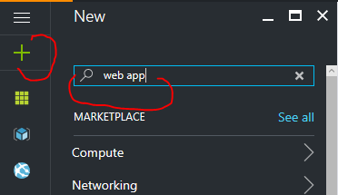

# .NET Web App, SQL, DocumentDB, ServiceBus, Function Apps, Application Insights

Simple ToDo application which uses ASP NET MVC front end, data are stored in Azure SQL database and each new ToDo item is processed to Service Bus. From Service bus are messages processed by Function Apps which are connected to Service Bus events. Function Apps create new entries in DocumentDB which is used like a storage for "comments" record for each ToDo record.  

## Prepare Azure resources

- Create Web App and Resource group which will host our application
    - in Azure portal click on resource group button in tool bar and than on "+ Add" button
    - 
    - Enter Resource group name and select right location for your resources
    - 
    - Create Web App - click on green "+" button in left top corner and enter "web app" to search area and press enter
    - 
    - Azure will show list of resources which can be created, use "Web App" - Microsoft/Web + Mobile and click "Create Button
    - 
    - Enter valid app name and select your existing Resource group created in previous steps
    - 
- Create Azure SQL database
    - Again use green "+" for creating new resource, enter "sql" to search area and press Enter
    - 
    - From list of resources select "SQL Database" - Microsoft/Database and than click Create button
    - 
    - Enter following data in creation form:
        - valid "Database name"
        - use existing Resource group created in previous steps
        - Create new "Server"
            - valid "Server name"
            - valid "Server name login"
            - valid "Password"
            - and right Location for your server
            - than click on Select button
        - Select right pricing tier
        - Click on Create button 
    - 
- Create DocumentDB database
    - Use green "+" button and and enter "documentdb" to search area
    - 
    - From list of resources select "NoSQL (DocumentDB)" - Microsoft/Storage and click Create
    - 
    - Enter valid ID for database
    - Use existing Resource group and right location for your resource
    - Click on Create button
    - 
- Wait for deploying all services

## Deploy Web App

- Publish App directly from Visual Studio
    - click right mouse on project ToDoWebApp and select "Publish" menu item
    - In publishing wizard select "Microsoft Azure App Service"
    - 
    - In case that needed re-enter your credential to Azure subscription
    - Select your subscription 
    - Select right Resource group
    - And select right Web App for deployment (created in previous steps)
    - 
    - click "Ok", wizard will load necessary information from your Subscription
    - Continue to next screen with default values (Web Deploy method)
    - On "Setting" screen continue with default (don't enter any information about connection string)
    - Continue with "Next" button and start deployment with "Publish" button

- Configure Web App in Azure portal 
    - Prerequisites - collect connection strings for resources
        - In Azure portal select your resource group and than select instance of DocumentDB
            - In Document DB pane select option "Keys" and collect data from "URI" and "PRIMARY KEY"
            -           
        - Select your "SQL database"
            - In SQL database pane select "Overview" option and than select link "Show database connection string", also you will need database user name and databse password used during database creation.
            - 
    - Select your Web App (App Service) from resource group
        - In App Service pane select option "Application settings"
        - In Application setting change following data
            - Switch application to 64 bit
            - 
            - In App setting section define variables for DOCDB_URL (DocumentDB URI), DOCDB_KEY (PRIMARY KEY)
            - 
            - In Connection strings section define connection with name DefaultConnection (with valid username and password)
            - 
        - Save changes in Application settings
- Now you can test application on URL which is shown in App Service Overview panel on HTTP or HTTPS

## Create VLAN for on-prem emulator

- In Azure portal select your resource group and than your Web App (App Service)
- Select in pane "Networking" option and in VNET Integration section click on link "Setup"
- 
- Than click on "Create New Virtual Network and in definition pane enter name of your Virtual Network,  address definition has to use default values, finally click on "OK"
- 
- Now wait for **aprox 40 minutes** for VLAN deployment
- Again select Web App, "Networking" option
- In Networking options select **again** link "Setup" in VNET Integration section and select your created VLAN in previous steps
- Finally we have to see connected our virtual network
- 

## Create on-prem emulator in VLAN (VM)

Use on of the following emulator version - Linux or Windows system. Emulator itself is dockerized core-net application with RESTFull interface running on port 5000 of VM.

#### Windows version of emulator
Windows version of emulator running on Windows 2016 server with docker extension, docker image itself is installed by Extension Script (extension script also creates scheduled task which startups docker image after reboot.
- Use green "+" button and enter "windows server 2016 datacenter - containers" in search box
- 
- From list of resources select "Windows Server 2016 Datacenter - with Containers"
- 
- 

#### Linux version of emulator
Linux version of emulator

## Test VLAN integration

## Create Service Bus and test messaging

## Create Func App for messages processing

create computer, integrate

create service bus, integrate
- todotopic
    - Category

create func app
 

