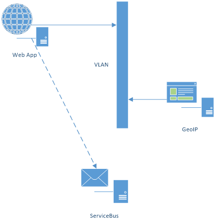

# .Net Web App, Azure SQL database, VLAN and Service Bus

Simple application which stores in database each request from client, client IP address is recognized in Geo-IP service and recognized location is stored in Azure SQL database. Each request is also serialized to JSON send to Service Bus topic.



## Scenario 1 - use Visual Studio to deploy app

- Create simple project
	- One page with table retrieved from DB
	- Take into account asynchronous programing technique: https://msdn.microsoft.com/en-us/magazine/dn802603.aspx
		- For JAVA https://plumbr.eu/blog/java/how-to-use-asynchronous-servlets-to-improve-performance
		- For JAVA: http://www.byteslounge.com/tutorials/asynchronous-servlets-in-java
	- Build, prepare to deploy (**github sources**)
		- https://github.com/vazvadsk/simplelist/
- Azure infrastructure
    - Create "Web App + SQL"
		- Create DB
		- Create web app
	- Deploy
		- Create deployment profile
		- Deploy to azure
	- Automatic deployment - bat file for deployment ...

```bat
echo ####### START
set buildconfig=Release
set deployconfig=xxxx
set deploypwd=xxxxxxxxxxx
"C:\Program Files (x86)\MSBuild\14.0\Bin\msbuild.exe" ASS\ASS.csproj /T:Clean;Rebuild;Publish /p:Configuration=%%buildconfig%% /p:DeployOnBuild=true /p:PublishProfile=%%deployconfig%% /p:Password=%%deploypwd%%
echo ####### DONE
```
- Create VNET for web app
	- Select web app
	- Networking -> create VNET … (setup)
	- Networking -> setup -> add vnet - 40 minutes deployment!!! (Web App has to have Standard or Premium plan - plan can be changed directly by link)
		- after deployment of VLAN once again check Network setting in Web App "Networking" - probably you have to run Setup again and select created VLAN in previous step
- Create GeoIP Service host
	- Create linux VM in VNET
		- `Ubuntu 16.04`
		- `sudo apt update --yes &sudo apt dist-upgrade --yes` (dont forgot to run addgroup command)
		- Docker: `wget -qO- https://get.docker.com/ | sh`
		- `mkdir geoip`
		- `cd geoip`
		- Download geoip DB: `wget http://geolite.maxmind.com/download/geoip/database/GeoLite2-City.mmdb.gz`
		- Unzip: `gzip -d GeoLite2-City.mmdb.gz`
		- Pull image: `docker pull klauspost/geoip-service`
		- Run geoip server:  `docker run -d -p 5000:5000 -v /home/valda/geoip/GeoLite2-City.mmdb:/data/geodb.mmdb klauspost/geoip-service`
- Update `web.config` file 
	- Setting key `GEOIPURL` has to be updated to internal IP address of linux VM

## Scenario 2 - connect to service bus
- Resources:
	- https://azure.microsoft.com/en-us/documentation/articles/event-hubs-csharp-ephcs-getstarted/
	- https://azure.microsoft.com/en-us/documentation/articles/service-bus-java-how-to-use-topics-subscriptions/
	- https://azure.microsoft.com/en-us/documentation/articles/service-bus-dotnet-get-started-with-queues/
- Tools: service bus explorer: https://code.msdn.microsoft.com/windowsapps/Service-Bus-Explorer-f2abca5a
- Deploy "Service Bus" to resource group
	- Create Topic (default values)
	- Create Subscription for `all` messages
	- Optionally define additional subscription named `category`
		- Define via "Service-Bus-Explorer" app
			- New Subscription with condition: `Category = '???'` 
- Update connection information for Service Bus Topic
	- Update connection in web.config - Change parameter in connection to valid Service Bus URI.

## Scenario 3 - process events from service bus
- Create Function app service
- Create new function and process messages from service bus
